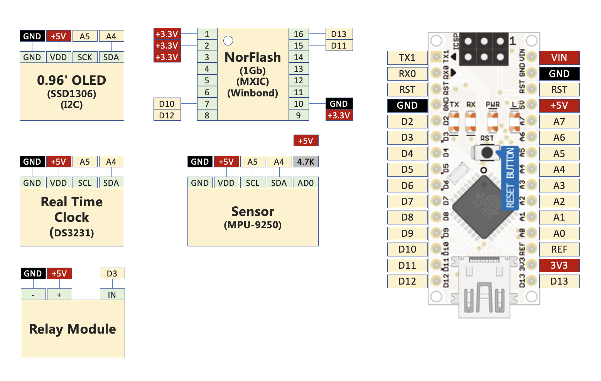
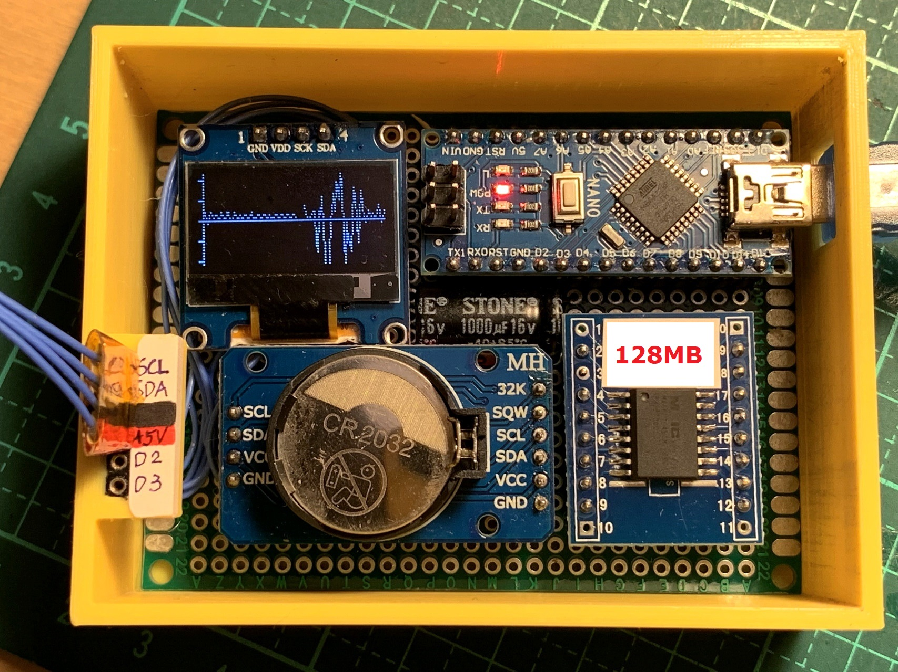
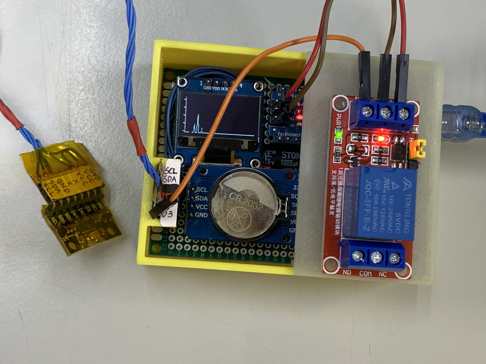

# Arduino_ADXL345_Logger_SSD1306 (震動紀錄器)
## 利用 ADXL345 的陀螺儀當作震動偵測器

## Wiring

## 材料
(1) Arduino Nano  
(2) ADXL345  
(3) 0.96吋OLED (128x64)  
(4) DS3231時鐘  
(5) SPI Nor Flash (Mxic or Winbond)(1Gb)  

## 3D列印外殼
(1) thingiverse: https://www.thingiverse.com/thing:4861300  
(2) tinkercad: https://www.tinkercad.com/things/eZMaNDogAWy  
(3) tinkercad: https://www.tinkercad.com/things/5Oew6IUhoHr

## 函式庫 
(1) 請複製library目錄中的所有資料到Arduino的library目錄 (ex: C:\Users\USERNAME\Documents\Arduino\libraries)  
(2) 或者可以自行下載，網址如下  
https://github.com/adafruit/Adafruit_ADXL345  
https://github.com/jarzebski/Arduino-DS3231  
https://github.com/adafruit/Adafruit_SSD1306  
https://github.com/Marzogh/SPIMemory  
https://github.com/adafruit/Adafruit-GFX-Library  
https://github.com/adafruit/Adafruit_Sensor 
https://github.com/adafruit/Adafruit_BusIO  

## 注意
(1) 螢幕解析度實際上只用到128x32，因為使用128x64，Arduino會記憶體不足  
(2) 預設每0.2秒會記錄一筆資料，可以連續紀錄約9天，超過會自動回頭覆蓋，就像行車紀錄器  
(3) Nor Flash 製作成可拆卸式的，需要讀取紀錄的時候，拆下來去另外一個裝置讀取  

## 照片  

